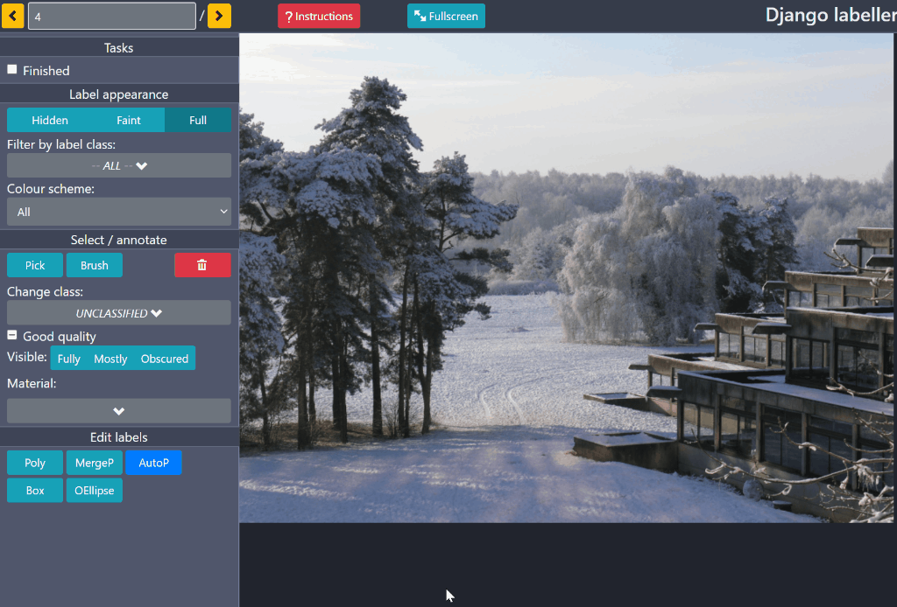

# django-labeller

#### A light-weight image labelling tool for Python designed for creating segmentation data sets.

- compatible with Django, Flask and Qt
- polygon, box, point and oriented ellipse annotations supported
- polygonal labels can have disjoint regions and can be editing using paintng and boolean operations; provided by
  [polybooljs](https://github.com/voidqk/polybooljs)
- can use the [DEXTR](http://people.ee.ethz.ch/~cvlsegmentation/dextr/) algorithm to automatically generate
  polygonal outlines of objects identified by the user with a few clicks; provided by the
  [dextr](https://github.com/Britefury/dextr) library
  
Django Labeller in action:



## Django, Flask or Qt?

If you want to run `django-labeller` on your local machine with minimum fuss and store the image and
label files on your file system, use either the Qt application or the Flask application.

If you want to incorporate `django-labeller` into your Django application, use the Django app/plugin as
it provides model classes that store labels in your database, etc.

## Installation

If you to use the example Django application or use the provided example images, clone it from GitHub and
install (*recommended*): 

```shell script
> git clone https://github.com/Britefury/django-labeller.git
> python setup.py install
````

To use it as a library, either with Flask or Django, install from PyPI:

```shell script
> pip install django-labeller
```

Note:
- `pip install django-labeller[django]` will also install the Django dependency
- `pip install django-labeller[dextr]` will also install the [dextr](https://github.com/Britefury/dextr) library


## Examples

### Qt desktop application

##### Requirements
`PyQt5` and `flask` need to be installed, both of which can be installed using `conda` if
using an Anaconda distribution.  
Optionally install [PyTorch](https://pytorch.org) and
the [dextr](https://github.com/Britefury/dextr) library if you want to use a DEXTR model for
automatically assisted annotation.

##### Running

A simple Qt-based desktop application allows you to choose a directory of images to label. To start it,
change into the same directory into which you cloned the repo and run:

```shell script
> python -m image_labelling_tool_qt.simple_labeller 
```

A dialog will appear prompting you to choose a directory of images to label. The *Enable DEXTR*
checkbox will enable DEXTR assisted automated labelling. Note that this requires that
[PyTorch](https://pytorch.org) and the [dextr](https://github.com/Britefury/dextr) library are
both installed in your Python environment.

The Qt desktop application uses QWebEngine to show the web-based component in a Qt UI.
A Flask server is started in the background that serves the tool HTML, static files and
images.


### Flask web app example

An example Flask-based web app is provided that displays the labelling tool within a web page. To start it,
change into the same directory into which you cloned the repo and run:
 
```shell script
> python -m image_labelling_tool.flask_labeller 
```

Now open `127.0.0.1:5000` within a browser.

If you want to load images from a different directory, or if you installed from PyPI, tell `flask_labeller`
where to look:

```shell script
> python -m image_labelling_tool.flask_labeller --images_pat=<images_directory>/*.<jpg|png>
```


#### Flask app with DEXTR assisted labelling

First, install the [dextr](https://github.com/Britefury/dextr) library:

```shell script
> pip install dextr
```

Now tell the Flask app to enable DEXTR using the `--enable_dextr` option:

```shell script
> python -m image_labelling_tool.flask_labeller --enable_dextr
````
 
The above will use the ResNet-101 based DEXTR model trained on Pascal VOC 2012 that is provided by
the dextr library. 
If you want to use a custom DEXTR model that you trained for your purposes, use the `--dextr_weights` option:

```shell script
> python -m image_labelling_tool.flask_labeller --dextr_weights=path/to/model.pth
````


### Django web app example

The example Django-based web app provides a little more functionality than the Flask app. It stores the label
data in a database (only SQLite in the example) and does basic image locking so that multiple users cannot work
on the same image at the same time.

To initialise, first perform migrations:

```shell script
> python simple_django_labeller/manage.py migrate
```

Now you need to import a labelling schema. Labelling schemes are stored as JSON files. For now, there is
a special one called `demo` that you can use. Load it into a schema named `default`:

```shell script
> python simple_django_labeller/manage.py import_schema default demo
```

Then populate the database with the example images in the `images` directory (replace `images` with the path
of another directory if you wish to use different images):

```shell script
> python simple_django_labeller/manage.py populate images
```

Then run the app:

```shell script
> python simple_django_labeller/manage.py runserver
```

#### Django app with DEXTR assisted labelling

First, install the [dextr](https://github.com/Britefury/dextr) library and [celery](http://www.celeryproject.org/):

```shell script
> pip install dextr
> pip install celery
```

Now install [RabbitMQ](https://www.rabbitmq.com/), using the appropriate approach for your platform (you could use
a different Celery backend if you don't mind editing `settings.py` as needed). 

Enable DEXTR within `tests/example_labeller_app/settings.py`; change the line

```py3
LABELLING_TOOL_DEXTR_AVAILABLE = False
```

so that `LABELLING_TOOL_DEXTR_AVAILABLE` is set to `True`.

You can also change the `LABELLING_TOOL_DEXTR_WEIGHTS_PATH` option to a path to a custom model, otherwise
the default ResNet-101 based U-net trained on Pascal VOC 2012 provided by the dextr library will be used.

Now run the Django application:

```shell script
> cd simple_django_labeller
> python manage.py runserver
```

Now start a celery worker:

```shell script
> cd simple_django_labeller
> celery -A example_labeller_app worker -l info
```

Note that Celery v4 and above are not strictly compatible with Windows, but it can work if you run:
```shell script
> celery -A example_labeller_app worker --pool=solo -l info
```


## API and label access

Please see the Jupyter notebook `Image labeller notebook.ipynb` for API usage. It will show you how to load
labels and render them into class maps, instance maps, or image stacks.


## Changes

Please see the [change log](./CHANGES.md) for recent changes.


## Libraries, Credits and License

Incorporates the public domain [json2.js](https://github.com/douglascrockford/JSON-js) library.
Uses [d3.js](http://d3js.org/), [jQuery](https://jquery.com/), [popper.js](https://popper.js.org/),
[PolyK](http://polyk.ivank.net/), [polybooljs](https://github.com/voidqk/polybooljs),
[Bootstrap 4](https://getbootstrap.com/docs/4.0/getting-started/introduction/),
 [Vue.js v3](https://vuejs.org/) and [spectrum.js](https://bgrins.github.io/spectrum/).

This software was developed by Geoffrey French in collaboration with Dr. M. Fisher and
Dr. M. Mackiewicz at the [School of Computing Sciences](http://www.uea.ac.uk/computing)
at the [University of East Anglia](http://www.uea.ac.uk) as part of a project funded by
[Marine Scotland](http://www.gov.scot/Topics/marine).

It is licensed under the MIT license.
